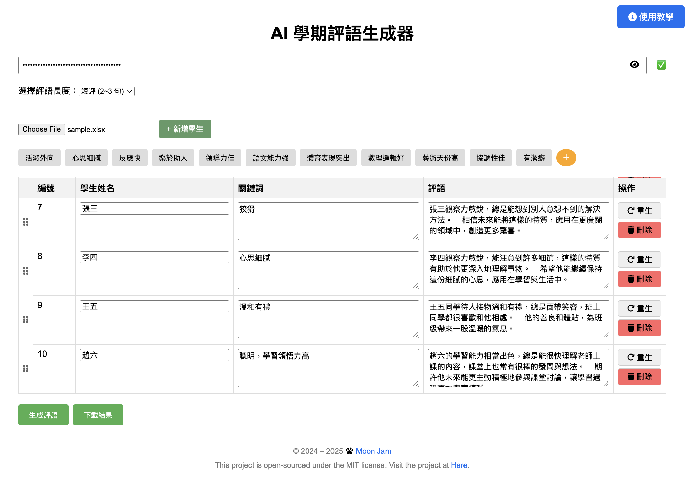
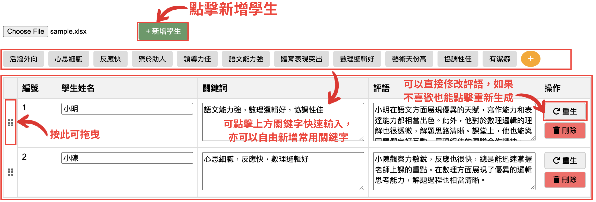
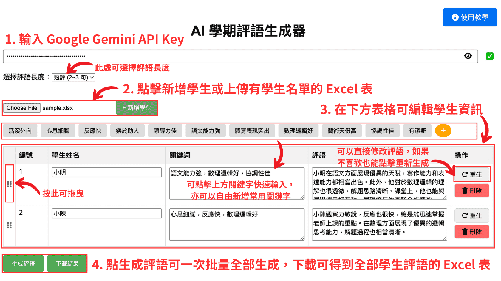
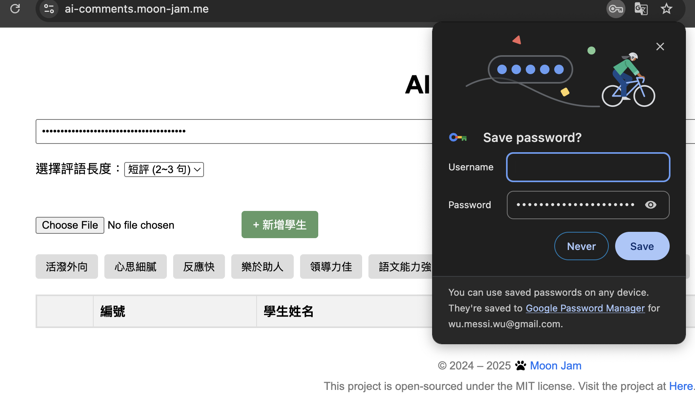

# AI Gen Semester Comments Tool

這是一個運用簡單幾個關鍵字自動生成期末評語的工具。

## Demo



## Python Version

- 創建一個 `config.py` 在 `python_version` 資料夾中，並在裡面寫入以下內容：

```python
GEMINI_API_KEY = 'YOUR_GEMINI_API_KEY'
```

- 安裝並進入虛擬環境(Poetry)：

```bash
poetry install
poetry shell
```

- 執行 `main.py`：

```bash
python main.py
```

## Website Version

可以直接在 [我架的網頁](https://ai-comments.moon-jam.me) 上使用這個工具，或是可以自己本地部署一個：

- cd 到 `website_version` 資料夾並安裝相關套件

```bash
cd website_version
npm install
```

- 執行網頁

```bash
npm run dev
```

- 到 [http://localhost:3000](http://localhost:3000) 開始使用

### 使用教學

- 先到 [Google AI Studio](https://aistudio.google.com/app/api-keys) 建立 API Key (如下圖)，接著將 API Key 複製然後貼到 [網頁](https://ai-comments.moon-jam.me) 的框框中，並確認出現 ✅ 圖示，代表 API Key 設定成功 (如果按照下圖無法順利創建，可以參考這個[影片](https://youtu.be/ehm3-xoJLsc))
 建立 API Key - 1](assets/step-1.png)
 建立 API Key - 2](assets/step-2.png)
 建立 API Key - 3](assets/step-3.png)
 建立 API Key - 4](assets/step-4.png)
 建立 API Key - 5](assets/step-5.png)
 建立 API Key - 6](assets/step-6.png)
 建立 API Key - 7](assets/step-7.png)
 建立 API Key - 8](assets/step-8.png)
〔方案選單〕
- <details>
  <summary> 方法一：上傳已經有學生名單的 Excel </summary>

  - 創建一個 Excel 檔，在 A 欄輸入學生的名字， B 輸入學生的幾個特質，類似如下的格式，可以參考 [`sample.xlsx`](sample.xlsx)
  
  - 點擊網頁中的 `選擇檔案` (`Choose File`)，選擇剛剛創建的 Excel 檔

</details>

- <details>
  <summary> 方法二：直接在網頁上輸入學生名字 </summary>

    - 先點擊上方的 `新增學生` ，接著輸入學生名字、關鍵字，其中關鍵字可以直接點擊上方的關鍵字列表快速輸入，也可以自己增加常用關鍵字
    
</details>

- 最後選擇評語長度，點擊下方的 `生成評語` 可以一次批量生成所有評語，生成完後點擊 `下載結果` ，就完成了！
- 完整流程如下：
  
- 小技巧：如果不想要每次都輸入 API Key，可以在第一次輸入完之後在瀏覽器的上方點擊鑰匙的圖標，按下儲存，下次只要打電腦密碼或指紋辨識就會自動輸入了
  
